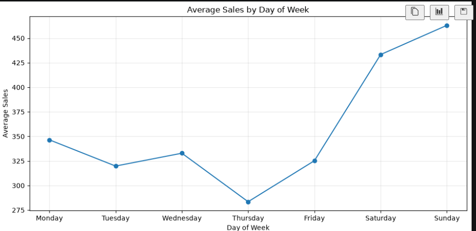
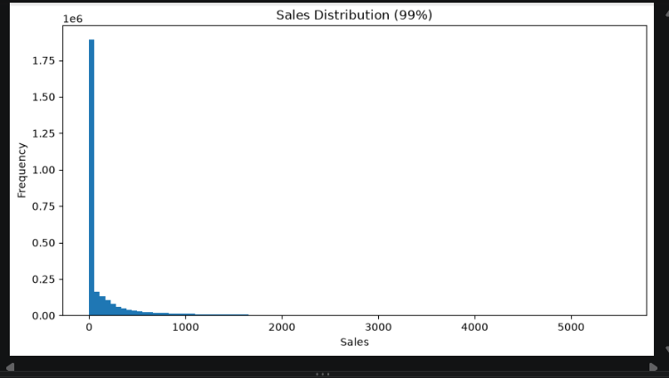
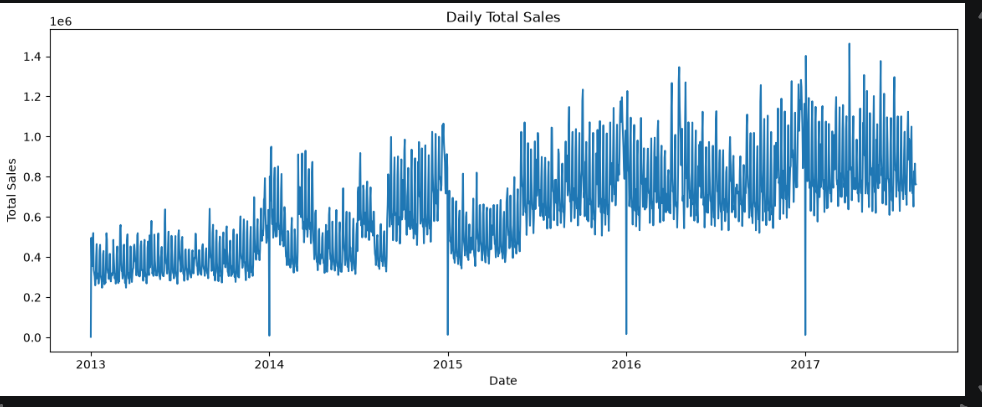
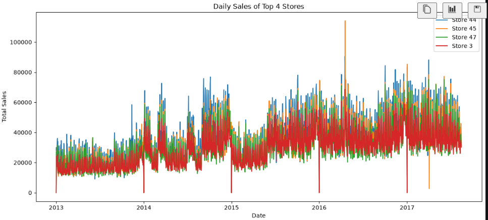
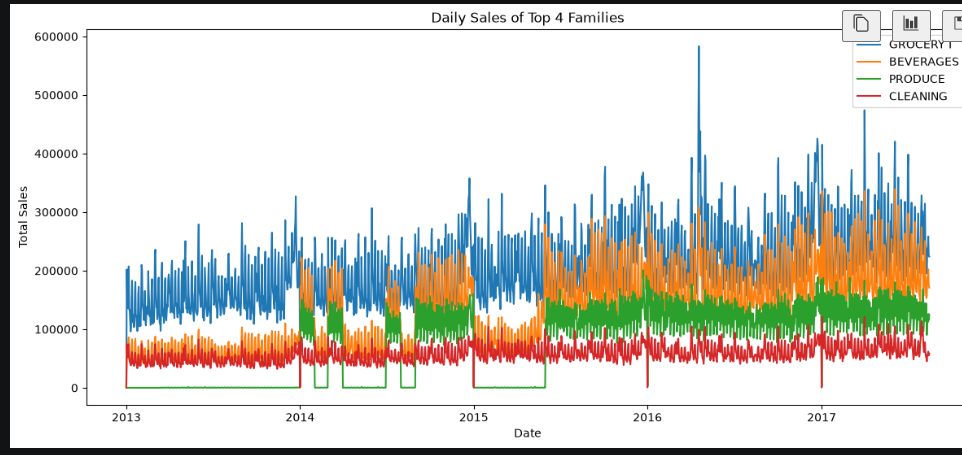
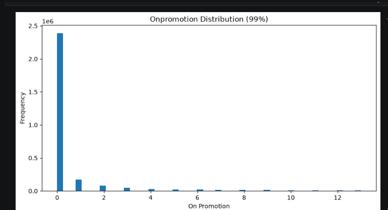
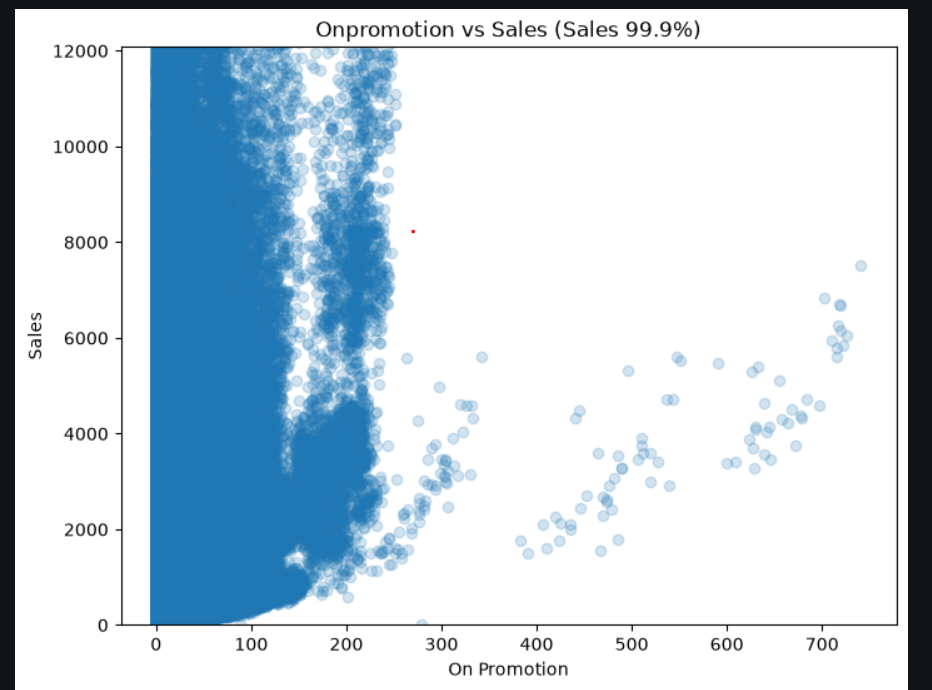

# EDA

> 이번 단계의 EDA는 마무리했다. 데이터의 전체적인 구조와 핵심 패턴, 날짜 구조, 주요 휴일·이벤트를 확인했으며, 이후 전처리·모델링 과정에서 이상한 성능이나 추가로 확인할 문제가 생기면 다시 EDA로 돌아와 보완할 예정이다.

## 데이터 구조

`train.csv`의 기본 구조를 확인했다.

```text
id           int64
date         str
store_nbr    int64
family       str
sales        float64
onpromotion  int64
```

전체 학습 데이터는 약 **300만 행**으로 구성되어 있다.

한 행은 기본적으로

> **특정 날짜(date) × 특정 매장(store_nbr) × 특정 상품군(family)의 판매량**

을 의미한다.

`store_nbr`는 판매량이나 매장 규모를 의미하는 수치형 변수가 아니라 **매장 ID**이다. 데이터에는 1번부터 54번까지의 매장이 존재한다. 수치형으로 저장되어 있어도 ID이므로 평균·표준편차 같은 통계값 자체는 의미가 거의 없다.

`family`는 개별 제품이 아니라 `GROCERY I`, `BEVERAGES`, `PRODUCE`, `CLEANING` 등과 같은 **상품군**이다.

새 데이터셋을 받았을 때의 기본 확인 루틴으로 다음을 사용했다.

```python
train.shape
train.head()
train.info()
train.isnull().sum()
train.describe()
train.nunique()
```

- `nunique()`는 각 컬럼에 서로 다른 값이 몇 종류 있는지, `unique()`는 실제 값의 종류가 무엇인지 보여준다.
- `describe()`의 `e+06`, `e+07`, `e+08` 같은 과학적 표기법은 각각 백만, 천만, 억 정도의 감각으로 읽는다.

이번 `train.csv`에서는 **결측치가 발견되지 않았다.**

다만 결측치가 없다고 데이터 전처리가 필요 없는 것은 아니다. `sales = 0`, `onpromotion = 0`, 극단적으로 큰 판매량, 날짜에 따른 패턴 등이 더 중요한 특징으로 보였다.

시계열 분석을 위해 `date`를 문자열에서 datetime 형태로 변환했다.

```python
train["date"] = pd.to_datetime(train["date"])
test["date"] = pd.to_datetime(test["date"])
```

또한 이 데이터는 하나의 시계열이라기보다,

> **매장 × 상품군마다 각각 하나의 판매량 시계열이 존재하는 패널 시계열**

형태로 이해했다.

---

## 날짜 구조 및 예측 구간

시계열 문제이므로 `train`과 `test`의 날짜 경계를 먼저 확인했다.

```python
print("Train:", train["date"].min(), "~", train["date"].max())
print("Test :", test["date"].min(), "~", test["date"].max())
print("Prediction days:", test["date"].nunique())
```

날짜 범위는 다음과 같다.

| 구분 | 기간 |
|---|---|
| Train | 2013-01-01 ~ 2017-08-15 |
| Test | 2017-08-16 ~ 2017-08-31 |
| 예측 기간 | 16일 |

즉 이 대회에서는 학습 데이터 마지막 날짜 직후의 **16일을 예측**한다.

날짜가 매일 연속되어 있다고 가정하지 않고 실제로 빠진 날짜도 확인했다. `train`에는 일부 날짜가 존재하지 않으며, 특히 2013~2016년의 **12월 25일(Christmas)**이 빠져 있다. 따라서 날짜 인덱스를 만들거나 lag/rolling feature를 생성할 때 단순히 행 번호만 기준으로 처리하면 안 되고 실제 날짜 간격을 고려해야 한다.

요일 정보도 날짜에서 추출할 수 있다.

```python
train["dayofweek"] = train["date"].dt.dayofweek
train["day_name"] = train["date"].dt.day_name()
```

`dayofweek`는 월요일부터 일요일까지 `0~6`의 정수로 표현하고, `day_name()`은 `Monday`, `Tuesday`처럼 사람이 읽기 쉬운 요일 이름을 반환한다.

요일별 평균 판매량도 확인했다.



단순 평균 기준으로는 **목요일의 평균 판매량이 가장 낮고, 주말인 토요일과 일요일에 판매량이 크게 높아지는 패턴**이 나타났다. 특히 일요일의 평균 판매량이 가장 높았다.

따라서 `dayofweek`는 판매량 예측에서 의미가 있을 가능성이 높은 시간 feature 후보로 보인다. 다만 이 그래프는 전체 기간의 단순 평균이므로 장기 추세, 공휴일, 프로모션 등 다른 요인의 영향도 섞여 있을 수 있다.

이번 EDA에서는 요일 효과의 존재 가능성을 확인하는 수준에서 마무리하고, 실제 성능 기여 여부는 모델링 과정에서 검증하기로 했다.

---

## Target 분석

Target은 `sales`이다. 반드시 정수 개수를 뜻하는 것은 아니고, 무게 단위로 판매되는 상품 때문에 소수값도 가능하다.

`describe()` 결과 주요 값은 다음과 같았다.

| 통계 | Sales |
|---|---:|
| 평균 | 약 358 |
| 25% 지점 | 0 |
| 중앙값 | 11 |
| 75% 지점 | 약 196 |
| 최대 | 약 12만 5천 |

평균이 약 358인데 중앙값은 11밖에 되지 않는다. 평균과 중앙값 차이가 크면 일부 큰 값이 평균을 끌어올리고 있을 가능성을 의심할 수 있다.

따라서 대부분의 판매량은 비교적 작은 값에 몰려 있고, 일부 매우 큰 판매량이 평균을 크게 끌어올리고 있다고 판단했다.

또한 25% 지점이 0이므로 **판매량 0도 상당히 많이 존재한다.**

`sales`의 분위수도 `quantile()`로 확인했다.

| 범위 | Sales |
|---|---:|
| 90% | 867 이하 |
| 95% | 1965 이하 |
| 99% | 5507 이하 |
| 99.9% | 약 1만 2076 이하 |

최대값은 약 12만 5천이지만 **99%의 데이터는 약 5500 이하**라는 점에서 극단적인 큰 값이 소수 존재한다는 것을 확인했다.

히스토그램은 x축이 값의 구간, y축이 해당 구간의 데이터 개수를 나타낸다. 전체 범위로 히스토그램을 그렸을 때는 극단값 때문에 대부분의 데이터가 0 근처에 눌려 보였다.

그래서 99%, 95%, 90% 구간으로 범위를 좁혀 확인했다. 이렇게 범위를 잘라 보는 것은 데이터를 삭제하는 것이 아니라, EDA에서 대부분의 데이터가 어떻게 생겼는지 확대해서 보는 것이다.



특히 범위를 좁혀 보았을 때도

> **0 및 낮은 판매량에 데이터가 매우 많이 몰려 있고, 판매량이 커질수록 빈도가 급격히 감소하지만 큰 값들이 오른쪽으로 계속 존재**

하는 모습을 확인했다.

분포의 치우친 방향은 데이터가 몰린 방향이 아니라 꼬리가 뻗은 방향으로 이름 붙인다. 따라서 `sales`는 **오른쪽 꼬리가 매우 긴 강한 right-skewed 분포**를 가진다고 판단했다.

---

## 시계열 패턴

전체적인 판매량의 시간 흐름을 확인하기 위해 날짜별로 모든 매장과 상품군의 판매량을 합산했다.

```python
daily_sales = (
    train.groupby("date")["sales"]
    .sum()
    .reset_index()
)
```

이를 일별 시계열 그래프로 확인했다.



가장 먼저 확인된 특징은 **장기적인 상승 추세(trend)**였다.

2013년 초반보다 2016~2017년의 일별 전체 판매량 수준이 전반적으로 높아져 있었다. 따라서 시간의 흐름에 따라 전체 판매량 자체가 증가하는 trend가 존재한다고 판단했다.

또한 일별 판매량이 단순하게 증가하는 것이 아니라 비교적 규칙적으로 위아래로 반복되는 모습이 나타났다. 따라서

> **요일, 월, 계절 등과 관련된 주기성 또는 계절성이 존재할 가능성**

이 있다고 판단했다.

다만 아직 정확한 주기를 분석하지 않았으므로 특정 주간·월간 계절성이라고 확정하지는 않았다.

또 하나 특이한 점은 **특정 시점마다 전체 판매량이 거의 0 근처로 급락하는 날이 반복적으로 존재한다는 것**이었다.

초기 가설로는

> 휴일, 휴점, 특정 이벤트 또는 사건과 관련될 가능성

을 생각했다. 이 부분은 이후 `holidays_events.csv` 등의 보조 데이터와 날짜를 비교하여 검증할 수 있다.

특정 날짜에 모든 매장·상품군이 비슷하게 움직인다면 개별 항목보다 공통적인 시간 요인이 강할 가능성이 있다.

현재까지 시계열 EDA에서 가장 강하게 느껴진 특징은 다음과 같다.

> **매장이나 상품군 개별 특성 이전에 전체 데이터에 공통으로 작용하는 시간 패턴이 상당히 강해 보인다.**

---

## 매장별 분석

총 54개 매장을 전부 하나씩 분석하기보다는, 먼저 전체 규모를 확인한 뒤 대표적인 몇 개를 골라 깊게 보는 방식을 택했다. 우선 매장별 전체 누적 판매량을 확인했다.

```python
store_sales = (
    train.groupby("store_nbr")["sales"]
    .sum()
    .sort_values(ascending=False)
)
```

누적 판매량 상위 매장은 다음과 같았다.

| 매장 | 누적 판매량 |
|---:|---:|
| 44 | 약 6209만 |
| 45 | 약 5450만 |
| 47 | 약 5095만 |
| 3 | 약 5048만 |
| 49 | 약 4342만 |
| 46 | 약 4190만 |
| 48 | 약 3593만 |
| 51 | 약 3291만 |

이 중 상위 4개인 **44, 45, 47, 3번 매장**의 일별 판매량을 비교했다. 상위 매장을 보는 이유는 단순히 판매량이 많아서가 아니라, 전체 패턴이 개별 그룹에서도 유지되는지 확인하기 위해서이다.



흥미롭게도 네 매장의 시계열이 **전체 판매량 시계열과 상당히 비슷한 형태**로 움직였다. 장기적인 상승 추세뿐 아니라 특정 시기의 상승·하락도 대체로 함께 나타났다.

따라서 상위 매장에서는

> **매장 고유 패턴뿐 아니라 전체 시장에 공통적으로 작용하는 시간 효과도 상당히 강할 가능성**

이 있다고 판단했다.

특정 날짜에 판매량이 거의 0까지 떨어지는 현상도 반복적으로 나타났다.

다만 현재는 판매량 상위 4개 매장만 확인했으므로, 이를 모든 54개 매장의 공통 특성이라고 확정하지는 않았다. 상위 매장의 공통적인 흐름을 확인했다는 정도로 해석했다.

---

## 제품군별 분석

33개 상품군도 전부 개별적으로 보기보다는 먼저 상품군별 누적 판매량을 확인했다.

주요 상위 상품군은 다음과 같았다.

| 순위 | 상품군 | 누적 판매량 |
|---:|---|---:|
| 1 | GROCERY I | 약 3억 4346만 |
| 2 | BEVERAGES | 약 2억 1695만 |
| 3 | PRODUCE | 약 1억 2270만 |
| 4 | CLEANING | 약 9752만 |
| 5 | DAIRY | 약 6449만 |
| 6 | BREAD/BAKERY | 약 4213만 |
| 7 | POULTRY | 약 3188만 |
| 8 | MEATS | 약 3109만 |

`PRODUCE`는 과일·채소 등의 **신선 농산물류**를 의미한다.

하위 상품군 중에서는 `BOOKS`, `BABY CARE`, `HOME APPLIANCES` 등의 전체 판매량이 매우 작았다. 따라서 상품군 사이의 판매 규모 차이가 상당히 크다는 것도 확인했다.

이후 상위 상품군의 날짜별 판매량 합계를 만들어 시계열로 비교했다.

상위 4개:

```text
GROCERY I
BEVERAGES
PRODUCE
CLEANING
```



추가로 상위 8개에서는 다음 상품군까지 포함해 비교했다.

```text
DAIRY
BREAD/BAKERY
POULTRY
MEATS
```

그래프를 확인하면서 식품·유제품 계열은 전체 판매량 변화에 비교적 민감하게 반응하며 함께 움직이는 모습이 보였다.

`CLEANING`은 상대적으로 안정적으로 유지되는 것처럼 보였지만, 자세히 보면 역시 전체적인 시간 변화 패턴과 비슷하게 움직이는 부분이 있었다.

따라서 상품군마다 절대 판매량과 변동 폭은 다르지만,

> **많은 상품군이 전체적인 시간 패턴의 영향을 공통적으로 받고 있다**

는 가설을 세웠다.

동시에 상품군마다 성격이 다르기 때문에 모델링에서는 다음을 함께 고려할 가치가 있다고 보았다.

- 전체적인 시간 패턴
- 상품군 고유 특성
- 상품군의 성격
- 특정 상품군만의 특수 변동

향후에는 상품군을 단순 ID로만 처리하기보다

> 식품 / 신선식품 / 생활용품 등과 같은 **거시적인 상품 성격**

을 활용할 가능성도 생각했다.

또 향후 모델링 결과 특정 상품군의 예측 성능이 유독 좋지 않다면 해당 상품군을 별도로 분석하여

> 특이한 시간 패턴 확인 → 관련 feature 추가 → ablation으로 실제 성능 개선 여부 확인

하는 방식도 고려할 수 있다고 판단했다.

반드시 거시 → 미시 순서의 별도 모델로 만들어야 하는 것은 아니며, 하나의 모델 안에서 공통 시간 feature와 상품군 정보를 함께 줄 수도 있다.

---

## 프로모션 영향

`onpromotion`은 광고 횟수가 아니다. 정확히는

> **해당 날짜 × 매장 × 상품군에서 프로모션 중인 개별 상품의 수**

이다.

`describe()` 결과 `onpromotion`은 25%, 50%, 75% 지점이 모두 0이었다.

실제로 다음 코드로 0의 비율을 확인했다. 조건식의 평균을 이용하면 특정 조건을 만족하는 데이터의 비율을 쉽게 계산할 수 있다.

```python
(train["onpromotion"] == 0).mean() * 100
```

결과는 약 **79.6%**였다.

즉,

> **전체 데이터 약 5개 중 4개는 프로모션 상품 수가 0**

이다.

히스토그램에서도 0에 데이터가 압도적으로 많이 몰려 있었고, 1 이상부터 빈도가 빠르게 줄어들었다. 그러면서도 일부 큰 프로모션 값이 존재하여 `onpromotion` 역시 **오른쪽 꼬리가 매우 긴 분포**를 보였다.



이후 `onpromotion`과 `sales`의 관계를 확인하기 위해 산점도를 그렸다. 한 변수의 분포는 히스토그램으로, 두 수치형 변수의 관계는 산점도로 보는 것이 기본이다.

```text
x축 = onpromotion
y축 = sales
```

전체 범위에서는 극단적인 판매량 때문에 대부분의 점이 아래쪽에 눌려 보여, `sales` 99.9% 범위로 줄여 다시 확인했다.



- 프로모션 0 근처에 데이터가 워낙 많이 몰려 있어 이 구간에서는 명확한 관계를 판단하기 어려웠다.
- 대략 100~300 수준에서는 복잡하게 퍼지는 모습이 보였다.
- 프로모션 상품 수가 매우 큰 영역에서는 프로모션 수가 증가하면서 판매량도 함께 증가하는 듯한 신호가 일부 보였다.

하지만 이를

> **"프로모션을 많이 하면 판매량이 증가한다."**

라고 바로 해석할 수는 없다.

판매 규모가 원래 큰 상품군일수록 판매량도 많고 프로모션 대상 상품도 많을 수 있기 때문에, 산점도의 관계를 곧바로 인과로 해석하면 안 된다. 현재는 **상관관계의 신호가 일부 보인다** 정도로 판단했다.

---

## 휴일 및 이벤트 데이터

`holidays_events.csv`도 가볍게 확인했다. 이 데이터는 날짜별로 `type`, `locale`, `locale_name`, `description`, `transferred` 등의 정보를 제공한다.

분석을 위해 먼저 날짜를 datetime으로 변환했다.

```python
holidays["date"] = pd.to_datetime(holidays["date"])
```

날짜순으로 확인했을 때 같은 날짜에 여러 개의 지역 행사나 공휴일이 동시에 존재하는 경우가 있었다. 또한 `description`은 스페인어 이름이 많고, 같은 큰 이벤트도 여러 세부 이름으로 나뉘어 있었다.

예를 들어 Christmas는 다음과 같이 여러 날짜로 표현된다.

```text
Navidad-4
Navidad-3
Navidad-2
Navidad-1
Navidad
Navidad+1
```

따라서 EDA에서는 원래 `description`을 그대로 하나씩 해석하기보다, 의미가 비슷한 이벤트를 임시로 `event_group`으로 묶어 구조를 확인했다.

주요 그룹은 다음과 같았다.

| event_group | count |
|---|---:|
| City Foundation | 80 |
| Local Anniversary | 54 |
| Independence Day | 41 |
| Christmas | 40 |
| Earthquake Event | 31 |
| Other | 30 |
| Provincial Anniversary | 24 |
| New Year | 14 |
| Carnival | 10 |
| Mothers Day | 10 |
| Labor Day | 5 |
| Good Friday | 5 |
| Cyber Monday | 3 |
| Black Friday | 3 |

이 결과에서 지역 단위 행사인 `City Foundation`, `Local Anniversary`, `Provincial Anniversary`가 상당히 많다는 점이 눈에 띄었다.

또한 휴일은 단순히 `holiday = 0/1`로 처리하기 어려운 구조였다.

- `National`: 전국에 적용
- `Regional`: 특정 지역에 적용
- `Local`: 특정 도시 등에만 적용
- `Transfer`: 원래 공휴일이 다른 날짜로 이동된 경우
- `Bridge`: 연휴를 연결하기 위한 휴일
- `Work Day`: 휴일 이동 등으로 인해 대신 근무하는 날

특히 `locale`과 `locale_name`이 있기 때문에 **지역 공휴일을 모든 매장에 동일하게 적용하면 안 된다.** 이후 전처리에서는 `stores.csv`의 도시·지역 정보와 연결할 필요가 있다.

`transferred`는 해당 공휴일이 실제로 다른 날짜로 옮겨졌는지를 나타낸다. 따라서 단순히 `description`만 보고 휴일 여부를 결정하지 않고 `type`, `locale`, `transferred`를 함께 보는 것이 필요하다.

### Test 기간의 휴일 확인

실제로 예측해야 하는 `test` 기간에 해당하는 휴일만 필터링했다.

```python
test_start = test["date"].min()
test_end = test["date"].max()

test_holidays = holidays[
    (holidays["date"] >= test_start) &
    (holidays["date"] <= test_end)
].sort_values("date")
```

확인 결과 `holidays_events.csv`에서 test 기간에 직접 해당하는 항목은 다음 한 건이었다.

| date | type | locale | locale_name | description | event_group | transferred |
|---|---|---|---|---|---|---|
| 2017-08-24 | Holiday | Local | Ambato | Fundacion de Ambato | City Foundation | False |

즉 **2017-08-24의 Ambato 도시 창립기념일**이며, 전국 공휴일이 아니라 `Ambato` 지역에만 해당한다.

따라서 모델링에서 이 날짜를 모든 매장에 동일한 공휴일로 표시해서는 안 되고,

> **2017-08-24 + Ambato에 위치한 매장**

이라는 조건으로 적용하는 것이 자연스럽다.

이번에 만든 `event_group`은 휴일 데이터를 이해하기 위한 **EDA용 단순화 그룹**이다. 실제 모델에서 그대로 feature로 사용할지는 전처리와 검증 과정에서 결정한다.

---

## 발견한 인사이트

이번 EDA를 통해 현재까지 세운 가장 중요한 가설은 다음과 같다.

**첫째, `sales`는 매우 강하게 오른쪽으로 치우친 분포다.** 낮은 판매량과 0에 데이터가 많이 몰려 있고, 일부 매우 큰 값이 긴 오른쪽 꼬리를 만든다.

**둘째, 프로모션 역시 대부분 0이다.** 약 79.6%가 `onpromotion = 0`이며, 큰 프로모션 수는 일부 데이터에서만 나타난다.

**셋째, Store Sales 문제에서는 시간 자체가 상당히 중요한 변수일 가능성이 높다.** 전체 판매량에 장기 상승 추세와 반복적인 변화가 나타나며, 상위 매장과 주요 상품군 역시 이러한 공통 시간 패턴을 상당 부분 공유한다.

**넷째, 날짜는 완전히 연속적이라고 가정하면 안 된다.** `train`에는 일부 날짜가 빠져 있으며, lag/rolling 등 시계열 feature를 만들 때 실제 날짜 간격을 고려할 필요가 있다.

**다섯째, 매장별 절대적인 판매 규모에는 차이가 있지만 상위 매장들의 시간적 움직임은 상당히 비슷하다.** 따라서 개별 매장 ID뿐 아니라 전체적인 시간 효과를 모델이 학습하도록 하는 것이 중요할 가능성이 있다.

**여섯째, 상품군별 판매 규모에는 매우 큰 차이가 있다.** `GROCERY I`, `BEVERAGES`, `PRODUCE` 등은 매우 큰 비중을 차지하는 반면 일부 상품군은 전체 판매량 자체가 매우 작다.

**일곱째, 상품군마다 변동 특성이 다르지만 많은 상품군이 공통적인 시간 흐름을 따라간다.** 따라서 향후에는 `family` 자체와 함께 상품군의 성격이나 시간과의 상호작용을 활용하는 방법을 생각해볼 수 있다.

**여덟째, 휴일·이벤트 데이터는 전국/지역/도시 단위가 섞여 있다.** 따라서 단순한 전역 `is_holiday` 하나보다는 `locale`, 매장 위치, `type`, `transferred` 등을 함께 고려하는 것이 더 자연스럽다.

**아홉째, 실제 test 기간에서 확인된 휴일 이벤트는 2017-08-24 Ambato의 도시 창립기념일이었다.** 지역 행사이므로 모든 매장에 적용하는 것이 아니라 Ambato 매장과 연결해야 한다.

**열째, 현재 가장 중요한 모델링 가설은 `공통 시간 패턴 + 매장 특성 + 상품군 특성 + 개별 시계열의 특수성 + 프로모션/휴일 등 외부 정보`를 함께 학습하는 것이다.**

개념적으로는 다음과 같이 생각할 수 있다.

```text
Sales
≈ 전체적인 시간 패턴
+ 매장별 특성
+ 상품군별 특성
+ 상품군/매장별 시간 반응 차이
+ 프로모션
+ 휴일·이벤트 등 외부 정보
```

다만 이는 **EDA를 기반으로 세운 가설이지 확정된 모델 구조는 아니다.**

### 한 줄 결론

> Store Sales 데이터는 판매량 분포가 매우 비대칭적이고 매장·상품군별 규모 차이도 크지만, 전체적으로 공통된 시간 패턴이 강하게 나타난다. 따라서 이후 모델링에서는 날짜 구조를 중심으로 매장·상품군 특성, 프로모션, 지역별 휴일·이벤트 정보를 함께 표현하는 것이 중요할 가능성이 높다.

### EDA에 대한 관점

EDA는 단순히 그래프를 많이 그리는 작업이 아니라, **"무엇을 알아야 하는가 → 어떤 그래프/통계로 확인할 것인가 → 이걸 모델에서 어떻게 활용할 것인가"**를 연결하는 과정이다.

데이터를 구경하는 단계가 아니라 모델링 가설을 만드는 단계이며, 모델링 전에 한 번 하고 끝나는 절차가 아니라 모델링 중에도 문제를 발견하면 다시 돌아오는 과정이다.

### 다음 작업

이번 단계의 EDA는 여기서 마무리하고 전처리로 넘어간다.

1. 날짜 feature 생성 (`year`, `month`, `day`, `dayofweek` 등)
2. `holidays_events.csv`와 `stores.csv`를 활용한 휴일·지역 정보 결합 방향 결정
3. `store_nbr`, `family` 등 범주형 변수 처리 방향 결정
4. 시간 순서를 보존한 train/validation 분리
5. Baseline 모델 학습 및 평가

이후 모델링 과정에서 특정 매장·상품군의 성능이 유독 나쁘거나 예상과 다른 패턴이 발견되면 해당 부분만 다시 EDA로 돌아와 추가 분석할 예정이다.
