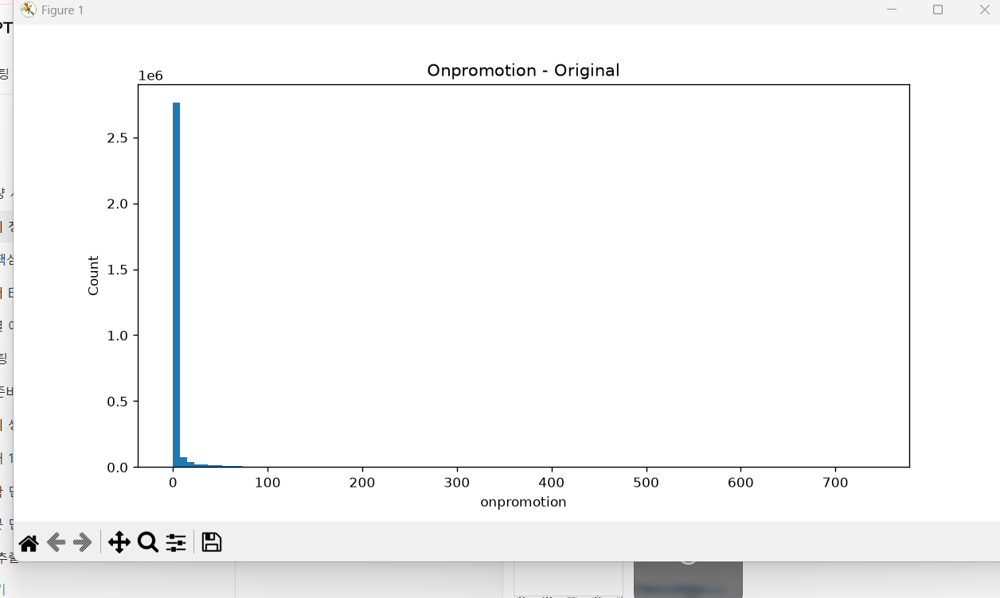
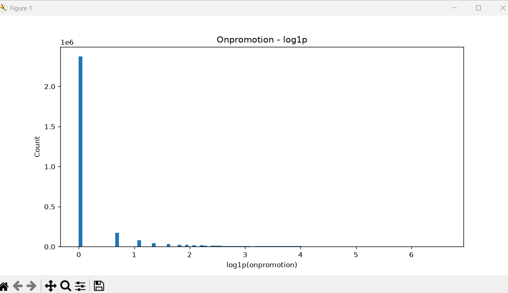
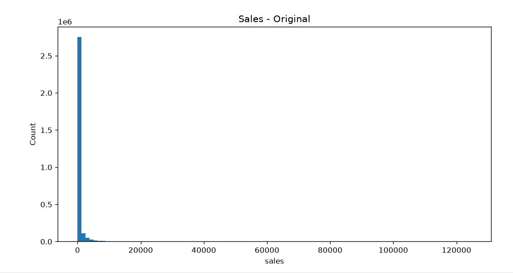
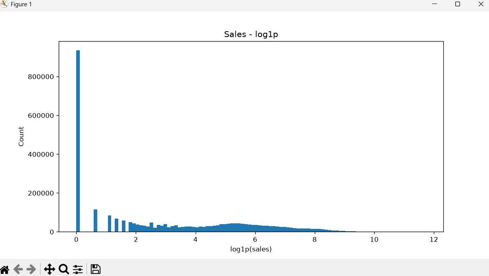

# Preprocessing

> EDA에서 확인한 데이터 구조와 문제점을 바탕으로, 모델링 전에 필요한 기본 전처리를 마무리했다. 이번 단계에서는 **누락 날짜 복원, 범주형 타입 정리, 이상치 처리 방향 결정, Target 로그 변환, Holiday 기본 정리, Validation 설계**까지 진행했다. 날짜·Promotion 파생 변수, Holiday와 Store의 지역 매칭, Lag/Rolling은 **Feature Engineering** 단계에서 다룬다. 이후 Validation 성능이 이상하거나 가정이 의심되면 다시 이 단계로 돌아와 보완할 예정이다.

## 전처리 범위

이번 단계에서는 **기본 전처리**와 **새로운 예측 정보를 만드는 Feature Engineering**을 구분했다.

| 구분 | 작업 |
|---|---|
| Preprocessing (이번 단계) | `date` → datetime, `store_nbr`/`family` → category, 누락 날짜 복원, Target 로그 변환, Holiday 기본 정리, Train/Validation 분리 |
| Feature Engineering (다음 단계) | `year`, `month`, `dayofweek`, `is_weekend`, `onpromotion_log`, `is_promotion`, Holiday-Store 매칭, Lag, Rolling |

사용한 데이터는 `train.csv`, `test.csv`, `holidays_events.csv`이다.

---

## 날짜형 변환

문자열로 저장된 `date`를 datetime으로 변환했다.

```python
train["date"] = pd.to_datetime(train["date"])
test["date"] = pd.to_datetime(test["date"])
holidays["date"] = pd.to_datetime(holidays["date"])
```

datetime으로 바꿔야 누락 날짜 탐색, 시간 기준 Train/Validation 분리, Holiday 날짜 매칭, 이후 Lag/Rolling 생성을 안정적으로 할 수 있다.

---

## 누락 날짜 처리

### 무엇이 빠져 있었나

EDA에서 날짜가 매일 연속인지 확인한 결과, `train`에는 아래 네 날짜가 **통째로** 존재하지 않았다.

| Missing Date |
|---|
| 2013-12-25 |
| 2014-12-25 |
| 2015-12-25 |
| 2016-12-25 |

```python
full_dates = pd.date_range(
    train["date"].min(),
    train["date"].max(),
    freq="D"
)

missing_dates = full_dates.difference(
    train["date"].drop_duplicates()
)
```

`holidays_events.csv`에서도 이 날짜들은 `Navidad`, 즉 전국 단위 Christmas로 확인된다.

### 판단

무작위 수집 오류라기보다 **4년 연속 같은 날짜가 전체 데이터에서 통째로 빠진 구조적 누락**으로 보았다. 그래서 이 날짜들을 **휴점일로 해석하여 시계열에 복원**하기로 했다.

### 복원 방식

한 날짜는 행 하나가 아니라 `날짜 × 매장 × 상품군` 조합으로 구성된다. 따라서 누락된 각 날짜마다 모든 `store_nbr × family` 조합을 만들어야 한다.

```text
4 days × 54 stores × 33 families = 7,128 rows
```

| 컬럼 | 추가된 행 | 기존 행 |
|---|---:|---:|
| `sales` | 0 | 원본 값 |
| `onpromotion` | 0 | 원본 값 |
| `is_added_missing_date` | 1 | 0 |

### 별도 표시를 남긴 이유

원본에 실제로 `sales=0`으로 기록된 행과, Christmas 누락일을 휴점일로 해석해 **인위적으로 추가한 행**은 출처가 다르다. `is_added_missing_date`를 남겨 두면 나중에 이 가정을 다시 검토할 수 있다. 이 컬럼은 전처리 추적용이며, 반드시 모델 Feature로 쓴다는 뜻은 아니다.

### 주의

이 처리는 데이터에서 직접 관측된 정답이 아니라 다음 근거에 기반한 **가정**이다.

- 누락 날짜가 4년 연속 정확히 12월 25일
- Holiday 데이터에서 Christmas로 확인
- 날짜 전체가 통째로 존재하지 않음

Validation 성능이나 모델 행동이 이상하면 이 가정부터 다시 점검한다.

---

## 범주형 변수 처리

`store_nbr`와 `family`는 값의 크기가 아니라 **서로 다른 그룹을 구분하는 ID**의 의미가 강하다.

- `store_nbr`: 매장 ID. 10번 매장이 5번 매장보다 두 배 크다는 뜻이 아니다.
- `family`: `GROCERY I`, `BEVERAGES`, `PRODUCE` 등 상품군.

```python
for df in (train, test):
    df["store_nbr"] = df["store_nbr"].astype("category")
    df["family"] = df["family"].astype("category")
```

---

## 이상치 처리 방향

EDA에서 `sales`와 `onpromotion` 모두 강한 right-skewed 분포였다. 처음에는 IQR 기준으로 이상치 후보를 확인했다.

### `sales`

| 통계 | 값 |
|---|---:|
| Q1 | 0 |
| Q3 | 195 |
| IQR | 195 |
| Q3 + 1.5 × IQR | 487.5 |
| Q3 + 3 × IQR | 780 |

| 기준 | 이상치 개수 | 비율 |
|---|---:|---:|
| 1.5 × IQR | 443,132 | 약 14.91% |
| 3 × IQR | 320,940 | 약 10.80% |

`3 × IQR`로 봐도 전체의 약 10.8%가 극단 이상치로 분류된다. 이는 희귀한 오류값이라기보다 **`sales` 자체가 원래 매우 강하게 오른쪽으로 치우친 분포**라는 뜻에 가깝다.

Percentile도 확인했다.

| Percentile | Sales |
|---|---:|
| 99.00% | 5,492.23 |
| 99.50% | 7,438.00 |
| 99.90% | 12,080.62 |
| 99.95% | 13,896.81 |
| 99.99% | 17,449.22 |

상위 0.01%(약 298개)의 Family별 분포는 다음과 같았다.

| Family | Count |
|---|---:|
| GROCERY I | 218 |
| BEVERAGES | 75 |
| PRODUCE | 4 |
| MEATS | 1 |

극단값이 여러 Family에 무작위로 흩어진 것이 아니라, 원래 판매 규모가 큰 **GROCERY I와 BEVERAGES에 구조적으로 집중**되어 있었다.

> **판단:** 큰 `sales`는 오류가 아니라 고판매 상품군의 정상적인 긴 꼬리일 가능성이 높다. **높은 값을 일괄 삭제하지 않는다.**

### `onpromotion`

`onpromotion`도 0에 크게 몰려 있고 긴 오른쪽 꼬리가 있다.

| Percentile | onpromotion |
|---|---:|
| 99.00% | 55 |
| 99.50% | 76 |
| 99.90% | 169 |
| 99.95% | 202 |
| 99.99% | 231 |

상위 극단값에는 500~700 이상도 있었다.

처음에 상위 0.01%만 잘라 `sales`와 상관을 계산했을 때는 음의 상관이 나왔다. 하지만 이는 **극단값 집단만 선택한 결과**이므로 전체 관계를 의미하지 않는다. 전체 Train 기준 결과는 다음과 같다.

| Method | Correlation |
|---|---:|
| Pearson | 약 0.426 |
| Spearman | 약 0.536 |

전체적으로는 **프로모션 상품 수가 많을수록 판매량도 증가하는 경향**이 있고, Family별 강도는 달랐지만 여러 주요 Family에서 양의 관계가 확인됐다.

> **판단:** 큰 `onpromotion` 값 자체가 실제 판매 패턴을 설명하는 정보일 수 있으므로 **일괄 삭제하지 않는다.**

#### 분포 비교 (원본 vs `log1p`)



원본은 0에 데이터가 매우 많이 몰려 있고, 큰 값이 긴 오른쪽 꼬리를 만든다.



`log1p` 적용 후 큰 값의 영향은 줄지만, 0이 워낙 많아 `sales`만큼 대칭적인 분포가 되지는 않았다. 그래서 `onpromotion_log`는 전처리에서 확정하지 않고 **Feature Engineering 후보**로 남겼다.

---

## Target 로그 변환

`sales`는 강한 right-skew를 보였고, 로그 변환 후 왜도가 크게 줄었다.

| Target | Skewness |
|---|---:|
| Original `sales` | 7.39 |
| `log1p(sales)` | 0.41 |

```python
sales_log = np.log1p(sales)   # log(1 + x), sales=0도 처리 가능
```



원본 `sales`는 낮은 값에 강하게 몰려 있고, 일부 매우 큰 값 때문에 오른쪽 꼬리가 길다.



`log1p` 적용 후에는 큰 값의 영향이 압축되어 분포가 훨씬 안정적으로 펼쳐졌다.

> **판단:** 대회 평가 지표가 RMSLE라서 로그 공간에서 Target을 다루는 방식과도 잘 맞는다. 원본 `sales`는 유지하고 `sales_log`를 **Target 후보로 추가**한다. 원본과 로그 Target 중 무엇이 더 나은지는 Validation 점수로 비교한다.

---

## Holiday 기본 전처리

`holidays_events.csv`에는 `date`, `type`, `locale`, `locale_name`, `description`, `transferred`가 있다. 같은 날짜에 National / Regional / Local Holiday가 동시에 존재할 수 있으므로 `drop_duplicates("date")`처럼 **날짜만 기준으로 중복을 제거하면 안 된다.**

### 수행한 처리

1. `date` → datetime
2. **완전히 동일한 행만** 제거
3. `transferred=True`인 원래 Holiday 행 제거
4. `date`, `locale`, `locale_name` 기준 정렬

`transferred=True`는 원래 휴일이 다른 날짜로 **이동했다**는 뜻이라, 원래 날짜를 그대로 쓰면 실제 휴일과 어긋난다. 반면 `type="Transfer"`처럼 이동된 실제 휴일을 나타내는 행은 별도로 존재하므로 함께 삭제하지 않는다.

### 아직 Merge하지 않은 이유

| locale | 적용 범위 |
|---|---|
| National | 전국 |
| Regional | 특정 State |
| Local | 특정 City |

`date`만으로 Train/Test에 Merge하면 지역 Holiday가 모든 Store에 잘못 적용된다. Holiday와 Store를 연결하려면 `stores.csv`의 `city`, `state`가 필요하므로 **Feature Engineering 단계**에서 처리한다.

---

## Train / Validation Split

### 구성

실제 Test 기간이 16일이므로, 학습 데이터의 **가장 마지막 16일을 Validation**으로 분리했다. Random split은 사용하지 않았다.

| Dataset | Date |
|---|---|
| Train | 2013-01-01 ~ 2017-07-30 |
| Validation | 2017-07-31 ~ 2017-08-15 |
| Test | 2017-08-16 ~ 2017-08-31 |

### 왜 마지막 16일인가

이 문제는 80:20 같은 비율 분할이 아니라 **과거 데이터로 바로 다음 16일을 예측하는 Forecasting 문제**다. 그래서 Validation의 비율보다 **실제 Test의 Forecast Horizon을 얼마나 비슷하게 재현하는가**가 더 중요하다고 판단했다.

```text
[Validation]  2013-01-01 ~ 2017-07-30 학습  →  2017-07-31 ~ 2017-08-15 예측
[Kaggle]      2013-01-01 ~ 2017-08-15 학습  →  2017-08-16 ~ 2017-08-31 예측
```

두 구조가 매우 유사하다. 비율은 작아 보여도 하루에 `54 × 33 = 1,782` 행이 있으므로 16일 Validation은 `1,782 × 16 = 28,512` 행이다.

### 왜 2016년 8월을 쓰지 않았나

Test가 8월이므로 2016년 8월 16일을 Validation으로 쓰는 방법도 고려했다. 같은 계절이라는 장점은 있지만, 이를 유일한 Validation으로 쓰면 학습 데이터가 2016년 여름 이전까지로 제한된다. 즉 2016년 하반기, 2017년 상반기·여름의 **최신 판매 패턴을 학습하지 못한다.** EDA에서 장기 상승 추세가 확인됐으므로, 첫 Validation은 가장 최근 데이터까지 활용할 수 있는 마지막 16일로 정했다.

### Validation 기간을 학습하지 않는 이유

Validation 16일의 `sales`를 학습에서 제외하는 것은 정보 손실이 아니라, **모델이 한 번도 보지 못한 미래처럼 만들어 평가하기 위한 과정**이다. 모델 구조와 Feature가 확정되면 Validation 기간까지 포함한 `2013-01-01 ~ 2017-08-15` 전체로 다시 학습하여 Test를 예측한다.

### 단일 Validation의 한계

마지막 16일 하나만 쓰면 빠르게 비교할 수 있고 Test 구조와도 유사하지만, 그 기간의 프로모션·Holiday·계절성·일시적 급증/급감에 점수가 흔들릴 수 있다. 한 번의 Validation에서 좋았다고 일반적으로 좋은 모델이라고 볼 수는 없다.

### 향후 Backtesting

Baseline과 Feature Engineering이 어느 정도 갖춰지면 16일 Horizon을 유지한 여러 Fold로 반복 검증한다. 각 Fold에서는 Validation 시점 이후 데이터를 학습에 쓰지 않는다.

| Fold | Train | Valid | 비고 |
|---|---|---|---|
| 1 | ~ 2016-07-31 | 2016-08-01 ~ 2016-08-16 | |
| 2 | ~ 2017-06-30 | 2017-07-01 ~ 2017-07-16 | |
| 3 | ~ 2017-07-30 | 2017-07-31 ~ 2017-08-15 | 현재 Validation |
| Seasonal | ~ 2016-08-15 | 2016-08-16 ~ 2016-08-31 | 전년도 동일 계절 구간 |

---

## 최종 QC

전처리 후 아래 항목을 확인한다.

| 항목 | 기대 결과 |
|---|---|
| 날짜 연속성 | Christmas 복원 후 Missing Dates = 0 |
| 추가 행 | 7,128 rows 정상 생성 |
| 기간 | Train / Validation / Test가 위 표와 일치 |
| 결측치 | 예상하지 못한 Null이 새로 생기지 않음 |
| 중복 | 의도하지 않은 완전 중복 행이 생기지 않음 |

---

## 주요 결정

**첫째, 극단값을 일괄 삭제하지 않는다.** `sales`와 `onpromotion` 모두 긴 오른쪽 꼬리를 갖지만, 극단값이 실제 판매 구조와 관련되어 있다고 판단했다. IQR 같은 기계적 기준으로 삭제하지 않는다.

**둘째, Christmas 누락 날짜를 휴점일로 복원한다.** 4년 연속 12월 25일이 통째로 빠졌고 Holiday 데이터에서도 Christmas로 확인됐다. `sales=0`, `onpromotion=0`으로 복원하되, 원본과 구분하도록 `is_added_missing_date`를 남긴다.

**셋째, `sales_log`를 Target 후보로 사용한다.** 왜도가 7.39에서 0.41로 크게 줄었고 RMSLE 지표와도 맞는다.

**넷째, Holiday 지역 매칭은 아직 하지 않는다.** National / Regional / Local을 실제 Store에 적용하는 일은 `stores.csv`를 쓰는 Feature Engineering 단계로 넘긴다.

**다섯째, Validation은 시간 순서를 보존한다.** 마지막 16일을 Validation으로 쓰고, 이후 여러 16일 Fold로 Backtesting을 확장한다.

### 한 줄 결론

> Store Sales의 기본 전처리에서는 극단값을 무리하게 제거하지 않고 실제 데이터 구조를 최대한 보존했다. 4년 연속 누락된 Christmas 날짜는 휴점일로 해석해 복원했고, 강한 right-skew를 가진 `sales`는 로그 Target 후보를 추가했다. Validation은 실제 Test와 같은 16일 Forecast Horizon으로 시간 순서를 유지했으며, 이후 여러 Time-Series Fold로 안정성을 추가 검증할 예정이다.

### 다음 작업: Feature Engineering

1. **Date Feature**: `year`, `month`, `day`, `dayofweek`, `is_weekend`
2. **Promotion Feature**: `onpromotion_log`, `is_promotion`
3. **Holiday Feature**: `stores.csv`와 연결해 적용 범위를 실제 Store와 매칭 (National → 모든 Store, Regional → 해당 State, Local → 해당 City). 이후 `is_holiday`, `holiday_type`, Holiday 개수, 지역 Holiday 여부 등을 필요에 따라 생성. Test 기간의 유일한 휴일인 2017-08-24 Ambato 창립기념일도 이 단계에서 Ambato 매장에만 적용
4. **Time-Series Feature**: `store_nbr × family` 단위의 Lag, Rolling Mean/Median, 과거 `sales=0` 비율, 최근 판매 추세

Feature를 만든 뒤에는 Baseline 모델을 학습하고, Validation RMSLE를 기준으로 각 Feature가 실제 성능 개선에 기여하는지 확인한다.

---

## 이미지 파일

```text
images/
├── preprocessing_sales_original.png
├── preprocessing_sales_log1p.png
├── preprocessing_onpromotion_original.png
└── preprocessing_onpromotion_log1p.png
```

`preprocessing.md`가 `docs/`에, 이미지가 프로젝트 루트의 `images/`에 있다면 본문의 `../images/...` 경로를 그대로 사용할 수 있다.